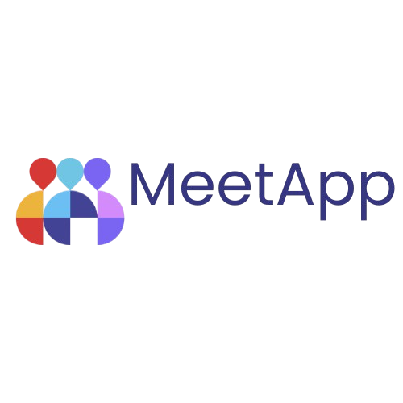
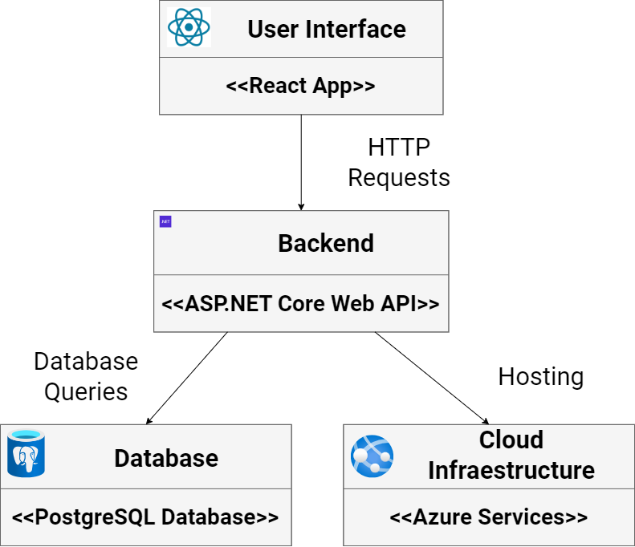
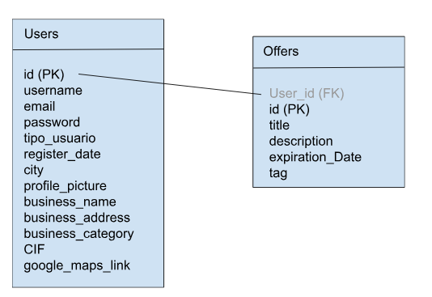

# MeetApp



## 📋 Overview

MeetApp is a full-stack web application designed to help people organize and participate in social activities and meetups. Users can create offers for activities, join existing activities, communicate through real-time chat, and discover events based on location and interests.

## ✨ Features

- **User Authentication & Authorization**: Secure JWT-based authentication with role management
- **Activity Management**: Create, edit, and browse activities with location-based search
- **Real-time Chat**: SignalR-powered chat functionality for activity participants
- **Offer System**: Businesses can create paid offers for premium activities
- **Google Maps Integration**: Location-based activity discovery and mapping
- **Multi-language Support**: Interface available in English, Spanish, and Bosnian
- **Progressive Web App (PWA)**: Install and use as a native app on mobile devices
- **Payment Integration**: Stripe payment processing for premium features (configurable)
- **Translation Services**: Azure AI Translation for multilingual content (configurable)
- **Responsive Design**: Mobile-first design using Ant Design components

## 🏗️ Architecture

MeetApp follows a modern three-tier architecture:

- **Frontend**: React 18 + TypeScript with Vite build tool
- **Backend**: ASP.NET Core 9.0 Web API
- **Database**: PostgreSQL with Entity Framework Core



### Technology Stack

#### Backend
- **Framework**: ASP.NET Core 9.0
- **ORM**: Entity Framework Core 9.0
- **Database**: PostgreSQL (via Npgsql)
- **Authentication**: ASP.NET Core Identity + JWT Bearer
- **Real-time**: SignalR
- **Payment**: Stripe.NET
- **Translation**: Azure AI Translation
- **API Documentation**: Swagger/OpenAPI

#### Frontend
- **Framework**: React 18.3
- **Language**: TypeScript 5.6
- **Build Tool**: Vite 5.4
- **UI Library**: Ant Design 5.21 (Web) / Ant Design Mobile 5.38
- **Routing**: React Router DOM 6.26
- **Maps**: Google Maps (@vis.gl/react-google-maps)
- **State Management**: React Auth Kit
- **Internationalization**: i18next + react-i18next
- **Real-time**: SignalR Client
- **PWA**: Vite PWA Plugin

## 📦 Prerequisites

Before you begin, ensure you have the following installed:

- **.NET SDK 9.0** or later ([Download](https://dotnet.microsoft.com/download))
- **Node.js 18** or later ([Download](https://nodejs.org/))
- **PostgreSQL 14** or later ([Download](https://www.postgresql.org/download/))
- **Git** ([Download](https://git-scm.com/downloads))

### Optional External Services

- **Google Maps API Key** (for location features)
- **Stripe Account** (for payment processing)
- **Azure AI Translation** (for translation services)
- **Firebase** (for push notifications)

## 🚀 Getting Started

### 1. Clone the Repository

```bash
git clone https://github.com/tarikkreso/MeetApp.git
cd MeetApp
```

### 2. Database Setup

1. Create a PostgreSQL database:
```sql
CREATE DATABASE meetapp;
```

2. Update the connection string in your configuration (see Configuration section below)

### 3. Backend Configuration

1. Navigate to the backend directory:
```bash
cd src/MeetApp.Backend
```

2. Copy the example configuration file:
```bash
cp appsettings.Example.json appsettings.json
```

3. Edit `appsettings.json` with your configuration:
```json
{
  "ConnectionStrings": {
    "AppDbContext": "Server=localhost;Database=meetapp;User Id=your_username;Password=your_password;TrustServerCertificate=True;"
  },
  "JwtBearer": {
    "Secret": "your-secret-key-minimum-32-characters-long"
  },
  "GoogleMaps": {
    "ApiKey": "your-google-maps-api-key"
  }
}
```

**⚠️ Security Note**: Never commit `appsettings.json` to version control. It's already in `.gitignore`.

4. Apply database migrations:
```bash
dotnet ef database update
```

### 4. Frontend Configuration

1. Navigate to the frontend directory:
```bash
cd src/MeetApp.Frontend
```

2. Copy the example environment file:
```bash
cp .env.example .env
```

3. Edit `.env` with your configuration:
```
VITE_API_BASE_URL=http://localhost:5000
VITE_GOOGLE_MAPS_API_KEY=your-google-maps-api-key
```

**⚠️ Security Note**: Never commit `.env` to version control. It's already in `.gitignore`.

4. Install dependencies:
```bash
npm install
```

### 5. Running the Application

#### Option A: Development Mode (Frontend + Backend Separately)

**Terminal 1 - Backend:**
```bash
cd src/MeetApp.Backend
dotnet run
```
The API will be available at `http://localhost:5000` and Swagger UI at `http://localhost:5000/swagger`

**Terminal 2 - Frontend:**
```bash
cd src/MeetApp.Frontend
npm run dev
```
The frontend will be available at `http://localhost:5173`

#### Option B: Production Build

1. Build the frontend:
```bash
cd src/MeetApp.Frontend
npm run build
```
This builds the frontend and outputs to `src/MeetApp.Backend/wwwroot`

2. Run the backend (which now serves the frontend):
```bash
cd src/MeetApp.Backend
dotnet run
```
The application will be available at `http://localhost:5000`

## 🛠️ Development

### Backend Development

```bash
# Restore dependencies
dotnet restore

# Build the solution
dotnet build

# Run tests (if available)
dotnet test

# Create a new migration
cd src/MeetApp.Backend
dotnet ef migrations add MigrationName

# Update database
dotnet ef database update
```

### Frontend Development

```bash
cd src/MeetApp.Frontend

# Install dependencies
npm install

# Run development server
npm run dev

# Build for production
npm run build

# Preview production build
npm run preview

# Lint code
npm run lint

# Generate PWA assets
npm run generate-pwa-assets
```

## 📚 API Documentation

When running the backend in development mode, Swagger UI is available at:
- `http://localhost:5000/swagger`

## 🗄️ Database Schema

The application uses the following main entities:
- **User**: Application users with roles (Student, Business)
- **Activity**: Social activities/meetups
- **Offer**: Premium activity offers from businesses
- **UserActivity**: Many-to-many relationship between users and activities
- **ActivityMessage**: Chat messages for activities
- **Role**: User roles for authorization



## 🔒 Security

### Configuration Security
- **Secrets Management**: All sensitive data (API keys, connection strings, JWT secrets) should be stored in:
  - Local development: `appsettings.json` (excluded from git) or User Secrets
  - Production: Environment variables or Azure Key Vault
- Never commit configuration files with secrets
- Use strong, randomly generated JWT secrets (minimum 32 characters)

### Authentication & Authorization
- JWT Bearer token authentication
- Password requirements enforced (8+ chars, upper/lower case, digit, special character)
- Role-based authorization (Student, Business roles)

### Best Practices Implemented
- CORS policy restricts allowed origins
- HTTPS redirection available (can be enabled in production)
- SQL injection protection via Entity Framework parameterized queries
- Input validation on API endpoints
- Sensitive data logging enabled only in development

## 🌍 Internationalization

The application supports multiple languages:
- English (en)
- Spanish (es)
- Bosnian (bs)

Translation files are located in `src/MeetApp.Frontend/src/locales/`.

## 🤝 Contributing

1. Fork the repository
2. Create a feature branch (`git checkout -b feature/AmazingFeature`)
3. Commit your changes (`git commit -m 'Add some AmazingFeature'`)
4. Push to the branch (`git push origin feature/AmazingFeature`)
5. Open a Pull Request

### Coding Standards
- Follow C# coding conventions for backend
- Follow TypeScript/React best practices for frontend
- Use meaningful variable and function names
- Add comments for complex logic
- Keep components small and focused

## 📄 License

This project is part of an academic/learning project. Please check with the repository owner for licensing details.

## 👥 Authors

- Development Team - University Project

## 🐛 Known Issues / Roadmap

- Azure Translation API integration (currently commented out)
- Stripe payment integration (currently commented out)
- Database migrations commented out in startup
- Consider adding automated tests

## 📞 Support

For issues, questions, or contributions, please open an issue on the GitHub repository.

---

**Note**: This is an educational project. Use appropriate security measures before deploying to production.